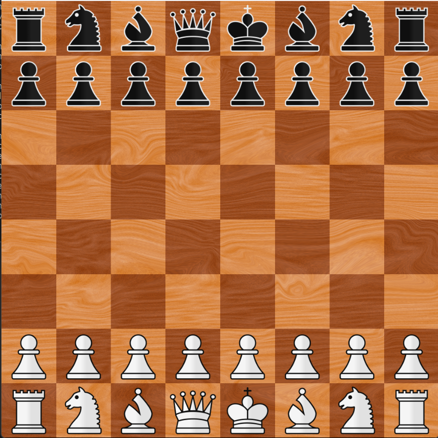

# ChessGame  




**Chess Game** is a implementation of the **classic chess game**, developed using C# and the WPF framework in Visual Studio. Leveraging the power of the .NET platform, this project provides a rich user interface and a robust set of features for an immersive chess-playing experience.

### Technical Features

- **C# Language**: The entire Chess Game logic is written in C#, a modern, object-oriented programming language known for its flexibility and ease of use.

- **WPF (Windows Presentation Foundation)**: The graphical user interface is built using WPF, a powerful framework for creating desktop applications on Windows. WPF enables the creation of visually stunning and interactive user interfaces.

- **MVVM Architecture**: The project follows the MVVM (Model-View-ViewModel) architectural pattern, separating concerns for clean and maintainable code. The model represents the game state, the view displays the user interface, and the view model orchestrates the interaction between the model and view.

- **.NET Framework**: The game relies on the .NET Framework, providing a robust and comprehensive set of libraries and tools for developing Windows applications.

## Requirements

Before you begin, ensure that your system meets the following requirements:

- **Git:** Ensure that Git is installed on your system. You can download it [here](https://git-scm.com/downloads).

- **.NET SDK:** The project requires the .NET SDK to be installed. You can download it [here](https://dotnet.microsoft.com/download).

- **Visual Studio (Optional):** If you prefer using Visual Studio for development, you can download the latest version [here](https://visualstudio.microsoft.com/downloads/).


## Installation and Usage

Follow these steps to install and run the Chess Game:

1. Clone the repository:

   ```bash
   git clone https://github.com/gustavoscardino/ChessGame.git
   cd ChessGame/
   dotnet run --project ./ChessGame/ChessGame.csproj
